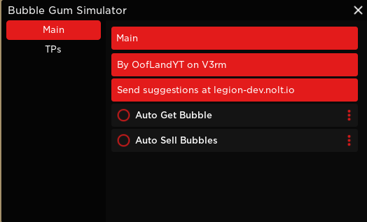
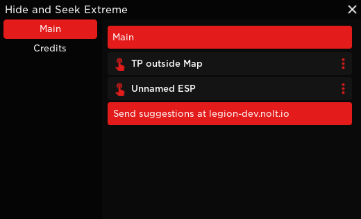
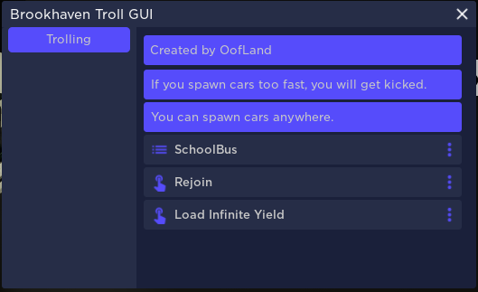
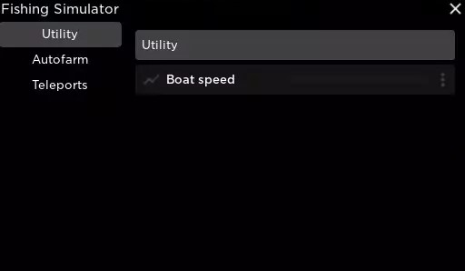

# LegionHub

This is where I store the Roblox scripts I develop.

------------

### Games
Bubble Gum Simulator (Features: Autofarm, Teleports) 

  

Hide And Seek Extreme (Features: TP out of Map, ESP)

  

Brookhaven (Features: Spawn car anywhere, admin commands, rejoin)

  

Fishing Simulator (Features: Autofarm, boat speed modifier, tween teleport)

  

------------

### How do I use this?
just execute the script with a exploit like synapse x

--------------

### Why did you make this?

because I was bored

